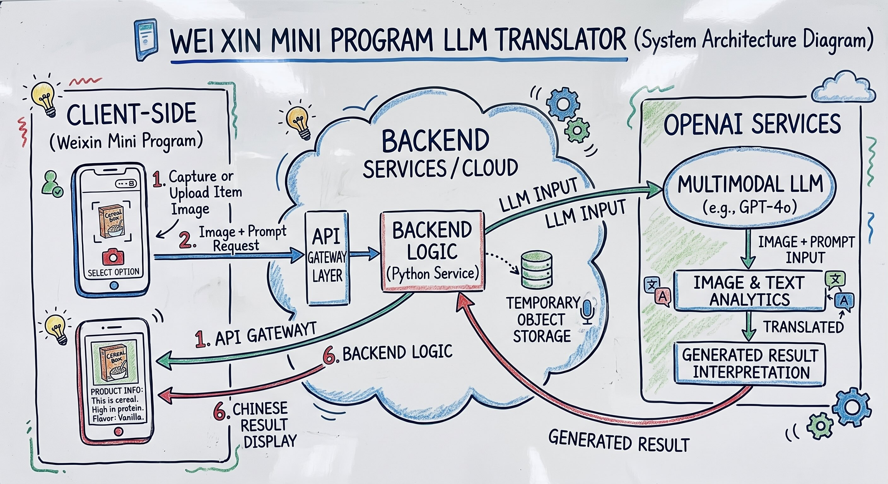
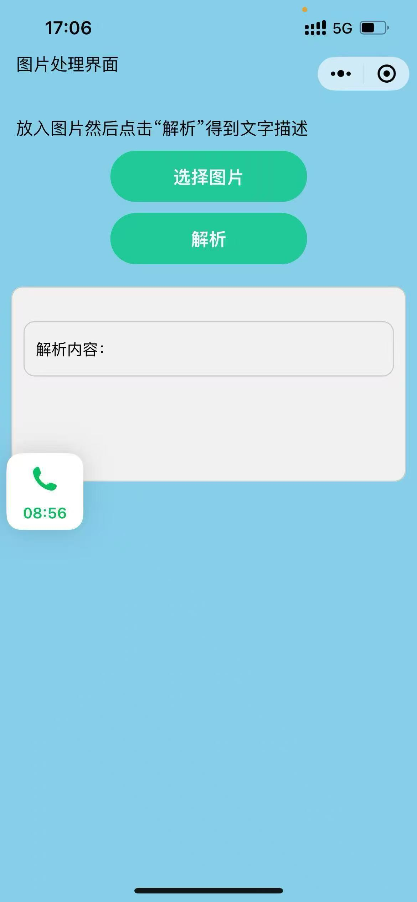

# LLM-Translator
A translator that can translate the words and image content in picture to Chinese. 

## Project Background：
This project was inspired by my grandmother, who lives in Athens but faces a significant language barrier because she cannot read Greek. Everyday activities, such as grocery shopping and deciphering product labels, often became frustrating obstacles for her. To help her navigate daily life more independently, I developed a lightweight WeChat Mini Program that translates Greek text into Chinese, allowing her to easily scan and understand product details on the go. 

## System Architecture：

## Project Status：
Archieved / Legacy Project (2023-2024). Active service decommissioned due to server deprecation.

## Screenshots / Demo：

  

